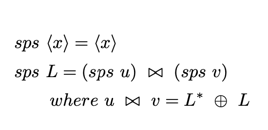
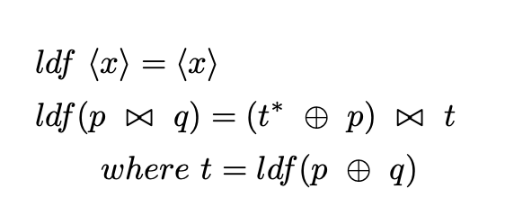
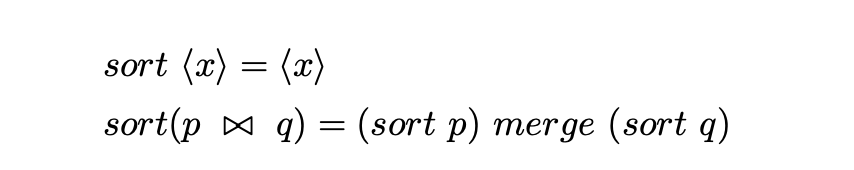
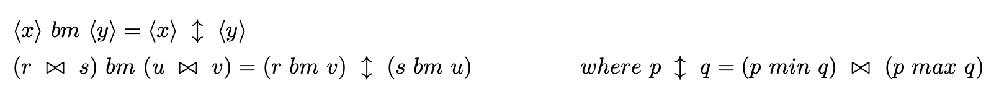

# Algorithms

We support many different algorithms of the following problems for benchmark and comparison.

- Prefix Sum (Scan)
  - ```SPS```                : The sequential prefix sum, which is nothing but scanl1 in haskell.
  - ```SPSPL```              : A sequential prefix sum using powerlist, to demonstrate equivalence.
  - ```SPSPLPar1```          : A parallel implementation of ```SPSPL```, with the Eval Monad, first attempt.
  - ```SPSPLPar2```          : More optimized parallel implementation of ```SPSPL```, with the Eval Monad.
  - ```SPSPLPar3```          : Only evaluate in parallel till certain depth, then fall back to scanl1.
  - ```LDF```                : The sequential Ladner Fischer algorithm implementation using powerlist.
  - ```LDFPar```             : A parallel implementation of ```LDF``` using eval monad.
  - ```SPSUBVecPLPar```      : An implementation of ```SPSPLPar3``` using Unboxed Vectors as powerlists, with more optimizations.
  - ```LDFUBVecPLPar```      : An implementation of ```LDFPar``` using Unboxed Vectors as powerlists, with more optimizations.
  - ```LDFChunkUBVecPLPar``` : An implementation of ```LDFUBVecPLPar``` that creates chunks of input and applies ```LDF``` scheme to each chunk in parallel. This is a hybrid of ```LDF``` and an algorithm due to Bleloch [[2]](#2).

- Sort
  - ```DEFAULT```            : Default sort in haskell.
  - ```BATCHER```            : A parallel implementation of the Batcher merge sort algorithm using powerlists.

  Read on for details.

## Scan

Scan algorithm is used to generate a prefix sum array from the input array, by summing all the elements of the array upto each element.
So for example the prefix sum for input array ```[1, 2, 3, 4]``` is given by ```[1, 3, 6, 10]``` (1 = 1, 3 = (1 + 2), 6 = (1 + 2 + 3), 10 = (1 + 2 + 3 + 4))

### SPS

The simplest sequential algorithm for scan runs through each elements, keeping track of the prefix sum of the previous element and adds the element to it to generate an output array element for each of the input element.
This is nothing but ```scanl1``` with ```(+)``` operator in haskell:

```haskell
Prelude> scanl1 (+) [1, 2, 3, 4]
[1,3,6,10]
```
### SPSPL

Powerlist allow a simple prefix sum function:



This translates beautifully into haskell code:

```haskell
sps :: Num a => (a -> a -> a) -> P.PowerList a -> P.PowerList a
sps _ [] = []
sps _ [x] = [x]
sps op l = P.zip (sps op u) (sps op v)
  where
    (u, v) = P.unzip $ P.zipWith op (P.rsh 0 l) l
```

This sequential implementation is presented to show the usefulness of powerlists and to benchmark parallel algorithms.
The powerlist implementation used for this and other algorithms is backed by ```List``` of haskell, for its simplicity and flexibility.

### SPSPLPar1

This is the first attempt at parallelizing ```SPSPL``` using the Eval monad. The algorithm is naturally recursive and divides the input into 2 equal sized arrays on which the ```SPSPLPar1``` can be called recursively.

```haskell
parSps1 :: (NFData a, Num a) => (a -> a -> a) -> P.PowerList a -> P.PowerList a
parSps1 _ [] = []
parSps1 _ [x] = [x]
parSps1 op l = runEval (do
    (u, v) <- rseq $ P.unzip $ P.zipWith op (P.rsh 0 l) l
    u' <- rparWith rdeepseq (parSps1 op u)
    v' <- rparWith rdeepseq (parSps1 op v)
    rseq $ P.zip u' v')
```

There is some bottleneck when we try to breakdown the list into equal halves, where we are doing several linear computations one after the other.
Note also that all these operations lead to creation of a lot of intermediate lists.

### SPSPLPar2

Here we further parallelize the ```unzip``` and the ```zipWith``` operations on powerlists.
Here is the parallel implementations used:

```haskell
parSps2 :: NFData a => Num a => (a -> a -> a) -> Int -> P.PowerList a -> P.PowerList a
parSps2 _ _ [] = []
parSps2 _ _ [x] = [x]
parSps2 op cs l = runEval (do
    k <- r0 $ P.parZipWith rdeepseq cs op (0: l) l
    u <- rpar (odds k)
    v <- rpar (evens k)
    _ <- rseq u
    u' <- rparWith rdeepseq (parSps2 op cs u)
    _ <- rseq v
    v' <- rparWith rdeepseq (parSps2 op cs v)
    rseq $ P.zip u' v')
```

1. The ```unzip``` operation is broken into 2 parallel operations to simply filter out elements at odd and even places.
2. The ```zipWith``` operation is parallelized by breaking the input into chunks and running the zipWith operation in parallel on the chunks. The chunkSize is supplied from the user and we can run benchmarks to observe which size works best.
3. There is a clever observation that since after right shift with ```0``` we are trying to run a zipWith operation, we can simply prepend ```0``` to the list and run the ```zipWith```, since ```zipWith``` will automatically only run the operation on elements at the same position in both lists and ignore the extra last element in the list where ```0``` was added.
This results in elimination of right shift operation.

### SPSPLPar3

This version further improves the runtime by recursing only till a certain depth, thereby reducing the total number of sparks generated. We revert to ```scanl1``` function for input arrays smaller than ```2^d``` length, where ```d``` is the depth parameter, which is set to ```4```.

### LDF

Another algorithm due to Ladner and Fischer can be implemented using powerlist as follows:



And here is the equivalent sequential implementation in haskell :

```haskell
ldf :: Num a => (a -> a -> a) -> P.PowerList a -> P.PowerList a
ldf _ []         = []
ldf _ [x]        = [x]
ldf op l         = P.zip (P.zipWith op (P.rsh 0 t) p) t
   where (p, q)  = P.unzip l
         pq      = P.zipWith op p q
         t       = ldf op pq
```
Again since the algorithm in naturally recursive over half the input array elements, it can be parallelized easily.

### LDFPar

This is the parallel implementation of ```LDF``` algorithm, using the eval monad.

The haskell code:

```haskell
parLdf :: NFData a => Num a => (a -> a -> a) -> Int -> Int -> P.PowerList a -> P.PowerList a
parLdf _ _ _ []        = []
parLdf _ _ _ [x]       = [x]
parLdf op cs d l | d > 4 = runEval (do
  p <- rpar (odds l)                                    -- 1
  q <- rpar (evens l)                                   -- 2
  _ <- rseq p                                           -- 3
  _ <- rseq q                                           -- 4
  pq <- rseq (P.parZipWith rdeepseq cs op p q)          -- 5
  t <- rparWith rdeepseq (parLdf op cs (d-1) pq)        -- 6
  k <- rseq (P.parZipWith rdeepseq cs op (0: t) p)      -- 7
  rseq $ P.zip k t)                                     -- 8
parLdf op _ _ l = sequentialSPS op l
```

Note that we add all the previous improvements introduced in parallel versions of ```SPS``` algorithm like:

1. We use chunking of input to parallelize ```zipWith``` operations over powerlists (which are just lists here), in steps 5 and 7.
2. We break powerlist ```unzip``` into 2 parallel ```filter``` operations on the original list.
3. We recurse only till depth 5 after which we fall back to ```sequentialSPS``` which is simply ```scanl1```.
4. The right shift is avoided by just prepending a ```0``` to list ```t``` and letting ```zipWith``` truncate the last extra element in step 7

Note that since this algorithm has just one recursion step compared to ```SPS``` it is already faster than previous algorithms seen.

### SPSUBVecPLPar

This algorithm is another implementation of [```SPSPLPar3```](#spsplpar3) but uses powerlist implementation using Unboxed Vectors.

```haskell
parSpsUBVec :: (NFData a, UV.Unbox a, Num a) => (a -> a -> a) -> Int -> Int -> UVP.PowerList a -> UVP.PowerList a
parSpsUBVec _ _ _ l | UV.length l <= 1 = l
parSpsUBVec op cs d l | d > 4 = runEval (do
    k <- rseq $ UVP.shiftAdd l
    u <- rpar (UVP.filterOdd k)
    v <- rpar (UVP.filterEven k)
    _ <- rseq u
    u' <- rparWith rdeepseq (parSpsUBVec op cs (d-1) u)
    _ <- rseq v
    v' <- rparWith rdeepseq (parSpsUBVec op cs (d-1) v)
    UVP.parZip (rparWith rdeepseq) cs u' v')
parSpsUBVec op _ _ l = UV.scanl1 op l
```

This is expected to be faster because:

1. Unboxed Vectors are more memory friendly.
2. We introduce some additional operations like ```shiftAdd``` which directly execute the shift and add operation using mutable vectors.

### LDFUBVecPLPar

This algorithm is another implementation of [```LDFPar```](#ldfpar) but uses powerlist implementation using Unboxed Vectors.

```haskell
parLdfUBVec :: (NFData a, UV.Unbox a, Num a) => (a -> a -> a) -> Int -> Int -> UVP.PowerList a -> UVP.PowerList a
parLdfUBVec _ _ _ l | UV.length l <= 1 = l
parLdfUBVec op cs d l | d > 4 = runEval (do
    p <- rpar $ UVP.filterOdd l
    q <- rpar $ UVP.filterEven l
    _ <- rseq p
    _ <- rseq q
    pq <- UVP.parZipWith (rparWith rdeepseq) op cs p q
    t <- rpar (parLdfUBVec op cs (d-1) pq)
    k <- rseq $ UVP.shiftAdd2 t p
    UVP.parZip (rparWith rdeepseq) cs k t)
parLdfUBVec op _ _ l = UV.scanl1 op l
```

It has the same advantages as the [```SPSUBVecPLPar```](#spsubvecplpar) algorithm above.
Note the use of ```shiftAdd2``` and ```filterOdd``` and ```filterEven``` functions that use mutable vectors and hence consume less memory.

### LDFChunkUBVecPLPar

This algorithm uses another flavor of [```LDFUBVecPLPar```](#ldfubvecplpar) where we first split the input into chunks, then run ```LDFUBVecPLPar``` over each of these chunks and then combine the results using a technique due to Bleloch.

The technique to finally combine the results from each of the chunks is illustrated below:


Advantages of this technique:
1. Since we use Unboxed Vector, splitting into chunks takes time proportional to the number of chunks.
2. Chunk size controls parallelism of the algorithm, making it more scalable than previous implementations.

Note that we were unable to implement the merging of results from chunks in parallel as the final step, using a single mutable vector and that is why the implementation is still not optimal.

## Sort

We exhibit only 2 sorting algorithms to sort a reverse list of input elements.

## Default

This is nothing but the ```Prelude.sort``` from haskell to sort list of elements.

```haskell
defaultSort :: Ord a => [a] -> [a]
defaultSort = sort
```

## Batcher Merge Sort

This is another application of powerlist where a simple sorting scheme is given by:



where we could use the batcher merge function for merging the 2 sorted sub-lists:



This again leads to this simple recursive sorting algorithm in haskell:

```haskell
batcherMergeSort :: (Ord a, V.Unbox a) => P.PowerList a -> P.PowerList a
batcherMergeSort l | V.length l <= 1 = l
batcherMergeSort l = sortp `batcherMerge` sortq
    where sortp = batcherMergeSort p
          sortq = batcherMergeSort q
          p     = P.filterOdd l
          q     = P.filterEven l

batcherMerge :: (Ord a, V.Unbox a) => P.PowerList a -> P.PowerList a -> P.PowerList a
batcherMerge x y | V.length x == 1 = V.fromList [hx `min` hy, hx `max` hy]
    where hx = V.head x
          hy = V.head y
batcherMerge x y = P.minMaxZip rv su
    where rv = r `batcherMerge` v
          su = s `batcherMerge` u
          r  = P.filterOdd x
          v  = P.filterEven y
          s  = P.filterEven x
          u  = P.filterOdd y
```

Note that this is using powerlist that is implemented using Unboxed Vector.

We use all the techniques used in the previous scan algorithms to come up with this parallel sort algorithm:

```haskell
parBatcherMergeSort :: (NFData a, Ord a, V.Unbox a) => Int -> P.PowerList a -> P.PowerList a
parBatcherMergeSort _ l | V.length l <= 1 = l
parBatcherMergeSort d  l | d > 5 = runEval(do
    p <- rpar $ P.filterOdd l
    q <- rpar $ P.filterEven l
    _ <- rseq p
    sortp <- rparWith rdeepseq (parBatcherMergeSort (d-1) p)
    _ <- rseq q
    sortq <- rparWith rdeepseq (parBatcherMergeSort (d-1) q)
    parBatcherMerge d sortp sortq)
parBatcherMergeSort _ l = V.fromList $ defaultSort $ V.toList l

parBatcherMerge :: (Ord a, V.Unbox a) => Int -> P.PowerList a -> P.PowerList a -> Eval (P.PowerList a)
parBatcherMerge d x y | d > 6 = do
    r <- rseq $ P.filterOdd x
    v <- rseq $ P.filterEven y
    rv <- parBatcherMerge (d-1) r v
    s <- rseq $ P.filterEven x
    u <- rseq $ P.filterOdd  y
    su <- parBatcherMerge (d-1) s u
    rparWith rdeepseq $ P.minMaxZip rv su
parBatcherMerge _ x y = rseq (merge x y)
```

Note that the ```merge``` function call in ```parBatcherMerge``` is the sequential ```merge``` of mergesort algorithm implemented using mutable vectors. Again this is used to reduce the number of spark generated, as this algorithm is already highly parallel.

# Future Work

There are other optimizations possible that can be explored further:

1. Exploiting the commutative laws of scalar functions over powerlist operators.

2. Using parallel libraries like [massive](https://github.com/lehins/massiv) that support nested parallelism.

