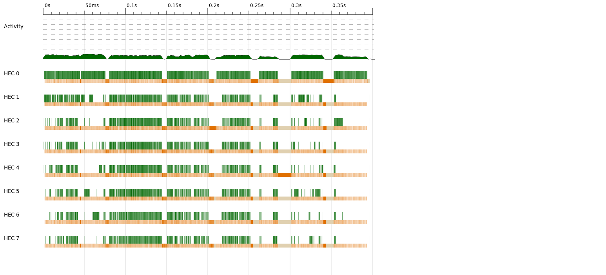

# Benchmarks
We list the benchmark of various supported algorithms here.
All benchmarks are performed on an 8 core (X2) Intel i9-9900K CPU @ 3.60GHz running Debian 11 (bullseye).
System has 32G of memory, and we specify wherever extra memory was supplied.

The output from the algorithms is the sum of the prefix sum array. This is to make sure everything was computed as expected.

## Scan

## Results Table
|Algo|Description|Array Size|Chunk Size|Num Cores|Time taken (s)|Threadscope Log|
|----|-----------|----------|----------|---------|--------------|---------------|
|[SPSPL](###SPS)|Sequential scan using powerlist|2^20|-|1|5.357|-|
|[SPSPLPar1](###SPSPL)|Parallel scan using powerlist|2^20|-|1.5|[SPSPLPar120.eventlog](https://github.com/saucam/powerlist-threadscope/blob/main/SPSPar/SPSPLPar120.eventlog)|
|LDFPar|2^20|100|8|0.644|[LDFPar20CS100.eventlog](https://github.com/saucam/powerlist-threadscope/blob/main/LDFPar/LDFPar20CS100.eventlog)|

Check below for more details.

### SPS
This is the linear iterative algorithm.
Simple prefix sum performs amazingly well on large arrays

### SPSPL
This is the sequential scan algorithm implemented using powerlists.
The sequential prefix sum using powerlists performs poorly as the array grows. It is expected since we introduce
recursion in an otherwise linear algorithm and generate a lot of intermediate lists which are GC'd.

Benchmarking results over a list of size 2^20:
```
$ stack exec powerlist-bench -- main/scan/seq/SPSPL +RTS
benchmarking main/scan/seq/SPSPL
time                 5.232 s    (5.208 s .. 5.241 s)
                     1.000 R²   (1.000 R² .. 1.000 R²)
mean                 5.334 s    (5.289 s .. 5.408 s)
std dev              70.09 ms   (20.22 ms .. 89.39 ms)
variance introduced by outliers: 19% (moderately inflated)

```

### SPSPLPar1 (Parallel Prefix sum using powerlist v1)
This is first attempt at parallelizing prefix sum implementation using powerlists.

As we can see from below threadscope result, there are several issues:


- The initial unzip tuple computation delays the parallelization
- A lot of sparks are getting created, most of them get GCd
- There are GC delays

Still there is quite an improvement over SPSPL, ```5.208 / 1.377 = 3.78X !```

```
$ stack exec powerlist-bench -- main/scan/par/nc/SPSPLPar1 +RTS -N8
benchmarking main/scan/par/nc/SPSPLPar1
time                 1.377 s    (NaN s .. 1.447 s)
                     1.000 R²   (NaN R² .. 1.000 R²)
mean                 1.375 s    (1.365 s .. 1.388 s)
std dev              18.16 ms   (11.95 ms .. 22.10 ms)
variance introduced by outliers: 19% (moderately inflated)
```

### Parallel Prefix sum using powerlist v2 (SPSPLPar2)
In this version, 
### Parallel Prefix sum using powerlist v3 (SPSPLPar3)

### Sequential Prefix sum using Ladner Fischer algorithm (LDF)

### Parallel Prefix sum using Ladner Fischer algorithm (LDFPar)

1. Run for array of length 2^20, using chunk size 100, over 8 cores


```
time stack run -- scan --algo LDFPar --size 20 --csize 100 +RTS -N8 -ls
192154133857304576

real	0m0.644s
user	0m1.368s
sys	0m1.116s
```



Load seems to be distributed evenly. There are GC pauses as expected as many intermediate lists are generated.