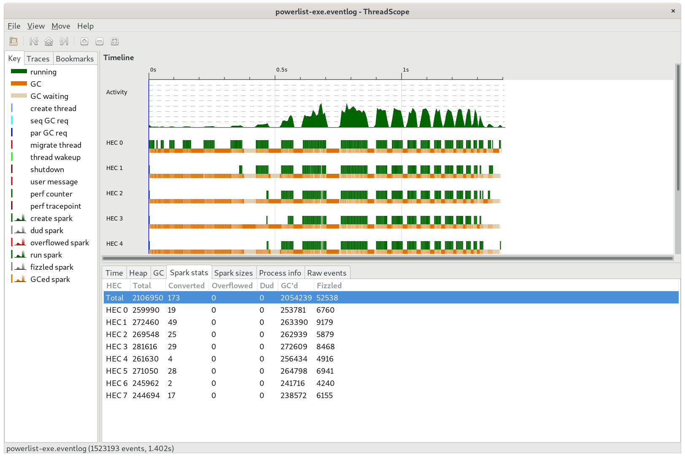
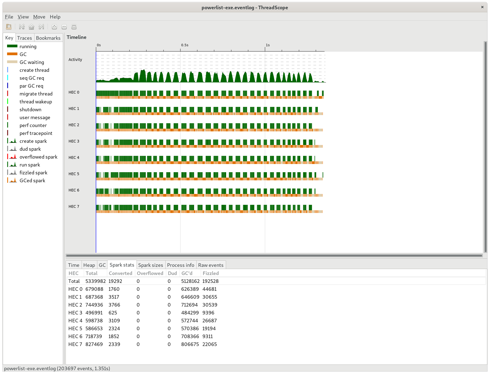
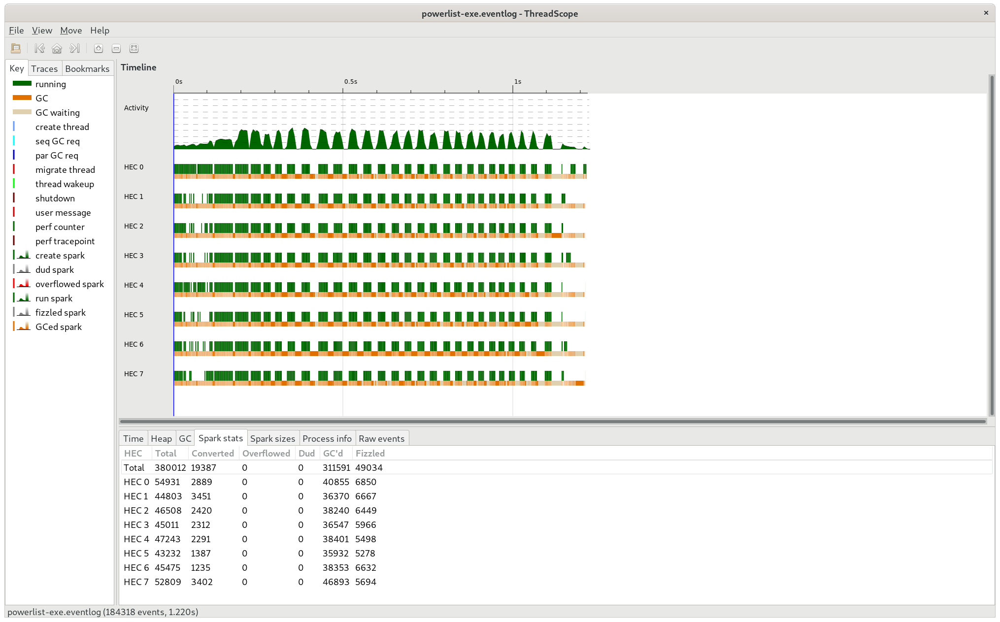
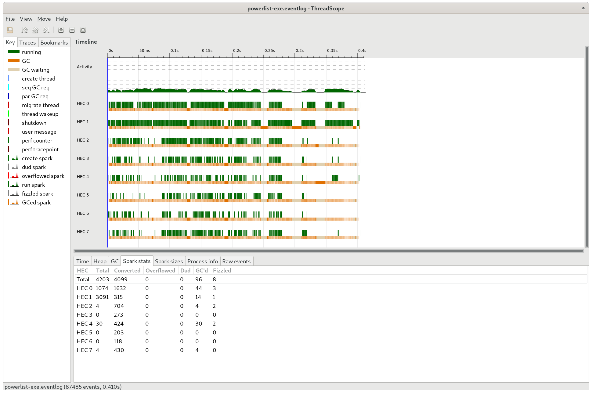
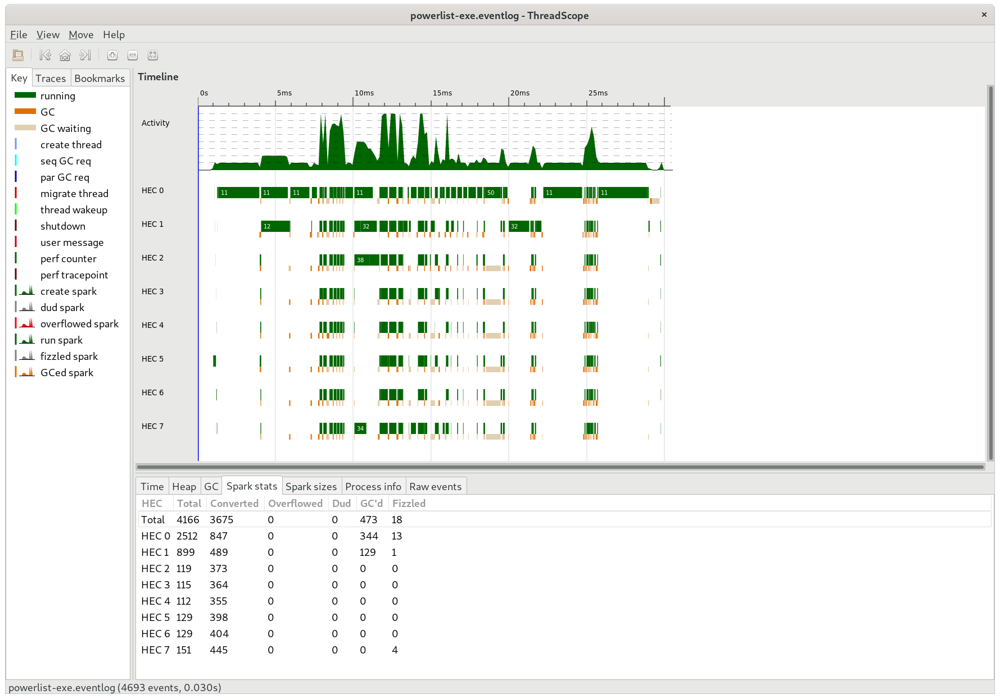
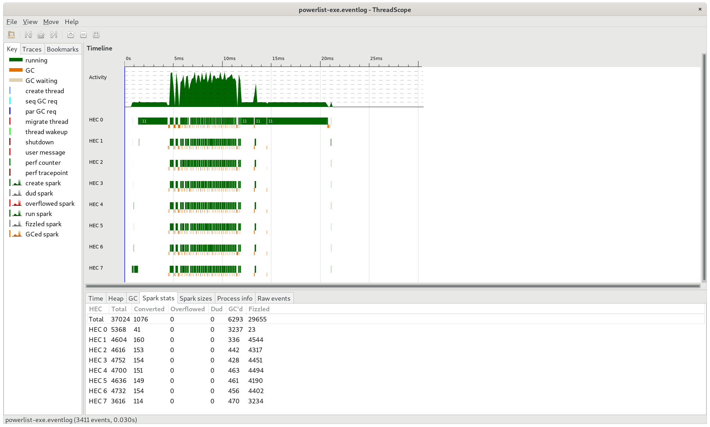

# Benchmarks
We list the benchmark of various supported algorithms here.
All benchmarks are performed on an 8 core (X2) Intel i9-9900K CPU @ 3.60GHz running Debian 11 (bullseye).
System has 32G of memory, and we specify wherever extra memory was supplied.

Benchmarks have been executed using [criterion](https://hackage.haskell.org/package/criterion) package, but threadscope analysis has also been used to analyze the performance of each algorithm.

The output from the algorithms is the sum of the prefix sum array. This is to make sure everything was computed as expected.

## Results Summary

### Scan SPS

|Algo|Description|Array Size|Chunk Size|Num Cores|Time taken (s)|Threadscope Log|
|----|-----------|----------|----------|---------|--------------|---------------|
|[SPSPL](#sps-sequential-scan-using-powerlist)|Sequential scan using powerlist|2^20|-|1|5.232|-|
|[SPSPLPar1](#spspl-parallel-scan-using-powerlist-v1)|Parallel scan using powerlist|2^20|-|8|1.506|[SPSPLPar120.eventlog](https://github.com/saucam/powerlist-threadscope/blob/main/SPSPar/SPSPLPar120.eventlog)|
|SPSUBVecPLPar|2^20|128|8|0.555||-|


### Scan LDF

|Algo|Description|Array Size|Chunk Size|Num Cores|Time taken (s)|Threadscope Log|
|----|-----------|----------|----------|---------|--------------|---------------|
|LDFPar|2^20|100|8|0.644|[LDFPar20CS100.eventlog](https://github.com/saucam/powerlist-threadscope/blob/main/LDFPar/LDFPar20CS100.eventlog)|

### Sort BATCHER

Check below for more details.

## Scan

### SPSPL (Sequential Scan using powerlist)

The sequential prefix sum using powerlist performs poorly as the array grows. It is expected since we introduce
recursion in an otherwise linear algorithm and generate a lot of intermediate lists which are GC'd.

Benchmarking results over a list of size 2^20:
```
$ stack exec powerlist-bench -- main/scan/seq/SPSPL +RTS
benchmarking main/scan/seq/SPSPL
time                 5.232 s    (5.208 s .. 5.241 s)
                     1.000 R²   (1.000 R² .. 1.000 R²)
mean                 5.334 s    (5.289 s .. 5.408 s)
std dev              70.09 ms   (20.22 ms .. 89.39 ms)
variance introduced by outliers: 19% (moderately inflated)

```

### SPSPLPar1 (Parallel Scan using powerlist v1)

This is first attempt at parallelizing prefix sum implementation using powerlists.

As we can see from below threadscope result, there are several issues:



- The initial unzip tuple computation delays the parallelization
- A lot of sparks are getting created, most of them get GCd
- There are GC delays

Still there is quite an improvement over ```SPSPL```,  !

```
$ stack exec powerlist-bench -- main/scan/par/nc/SPSPLPar1 +RTS -N8
benchmarking main/scan/par/nc/SPSPLPar1
time                 1.506 s    (1.316 s .. 1.576 s)
                     0.996 R²   (0.994 R² .. 1.000 R²)
mean                 1.393 s    (1.324 s .. 1.448 s)
std dev              77.82 ms   (70.55 ms .. 79.28 ms)
variance introduced by outliers: 19% (moderately inflated)
```

### SPSPLPar2 (Parallel Prefix sum using powerlist v2)

We benchmark at 3 different chunk size 128, 256, 512

```
$ stack exec powerlist-bench -- --match pattern SPSPLPar2 +RTS -N8
benchmarking main/scan/par/128/SPSPLPar2
time                 1.635 s    (1.429 s .. 1.691 s)
                     0.997 R²   (0.990 R² .. 1.000 R²)
mean                 1.559 s    (1.529 s .. 1.622 s)
std dev              49.62 ms   (29.51 ms .. 55.08 ms)
variance introduced by outliers: 19% (moderately inflated)

benchmarking main/scan/par/256/SPSPLPar2
time                 1.525 s    (1.486 s .. 1.625 s)
                     0.999 R²   (0.996 R² .. 1.000 R²)
mean                 1.549 s    (1.531 s .. 1.579 s)
std dev              30.26 ms   (15.70 ms .. 34.72 ms)
variance introduced by outliers: 19% (moderately inflated)

benchmarking main/scan/par/512/SPSPLPar2
time                 1.542 s    (NaN s .. 1.665 s)
                     0.999 R²   (0.996 R² .. 1.000 R²)
mean                 1.557 s    (1.541 s .. 1.567 s)
std dev              25.17 ms   (12.45 ms .. 28.79 ms)
variance introduced by outliers: 19% (moderately inflated)
```

Slightly worse than previous, most likely due to lot of sparks being created:



### SPSPLPar3 (Parallel Prefix sum using powerlist, introduce depth)

Reduce the number of sparks by recursing till a certain depth.

```
$ stack exec powerlist-bench -- --match pattern SPSPLPar3 +RTS -N8
benchmarking main/scan/par/128/SPSPLPar3
time                 1.399 s    (1.287 s .. 1.497 s)
                     0.999 R²   (0.997 R² .. 1.000 R²)
mean                 1.475 s    (1.447 s .. 1.503 s)
std dev              51.38 ms   (32.67 ms .. 65.55 ms)
variance introduced by outliers: 19% (moderately inflated)

benchmarking main/scan/par/256/SPSPLPar3
time                 1.397 s    (1.252 s .. 1.413 s)
                     0.998 R²   (0.994 R² .. 1.000 R²)
mean                 1.434 s    (1.410 s .. 1.453 s)
std dev              41.29 ms   (29.74 ms .. 47.58 ms)
variance introduced by outliers: 19% (moderately inflated)

benchmarking main/scan/par/512/SPSPLPar3
time                 1.391 s    (1.390 s .. 1.404 s)
                     1.000 R²   (1.000 R² .. 1.000 R²)
mean                 1.414 s    (1.403 s .. 1.423 s)
std dev              15.59 ms   (3.254 ms .. 20.39 ms)
variance introduced by outliers: 19% (moderately inflated)
```

Performs slightly better. We can see the number of sparks have reduced:



### LDF (Sequential scan using Ladner Fischer algorithm)

Performs much better since this algorithm does less work than SPS.

```
$ stack exec powerlist-bench -- main/scan/seq/LDF
benchmarking main/scan/seq/LDF
time                 490.7 ms   (426.7 ms .. 574.2 ms)
                     0.997 R²   (0.989 R² .. 1.000 R²)
mean                 443.6 ms   (429.5 ms .. 455.9 ms)
std dev              29.15 ms   (23.32 ms .. 32.58 ms)
variance introduced by outliers: 19% (moderately inflated)
```

### LDFPar (Parallel scan using Ladner Fischer algorithm)

Parallel version, further reduces the time, uses chunking for operations like ```zipWith```

```
benchmarking main/scan/par/128/LDFPar
time                 459.8 ms   (413.8 ms .. 614.0 ms)
                     0.977 R²   (0.917 R² .. 1.000 R²)
mean                 436.2 ms   (426.9 ms .. 460.8 ms)
std dev              40.72 ms   (148.6 μs .. 46.38 ms)
variance introduced by outliers: 22% (moderately inflated)

benchmarking main/scan/par/256/LDFPar
time                 467.6 ms   (355.2 ms .. 542.9 ms)
                     0.994 R²   (0.979 R² .. 1.000 R²)
mean                 419.5 ms   (358.7 ms .. 442.6 ms)
std dev              43.17 ms   (15.77 ms .. 52.87 ms)
variance introduced by outliers: 23% (moderately inflated)

benchmarking main/scan/par/512/LDFPar
time                 392.1 ms   (358.8 ms .. 450.1 ms)
                     0.998 R²   (0.994 R² .. 1.000 R²)
mean                 383.7 ms   (371.3 ms .. 395.3 ms)
std dev              19.57 ms   (1.240 ms .. 26.99 ms)
variance introduced by outliers: 19% (moderately inflated)
```

Sparks have reduced significantly as expected, and hence the better run time:



Load seems to be distributed evenly. There are GC pauses as expected as many intermediate lists are generated.

### SPSUBVecPLPar (SPSPLPar3 using Unboxed Vector, with additional improvements)

Significant improvement over ```SPSPLPar3```. We try several chunk sizes

```
$ stack exec powerlist-bench -- --match pattern SPSUBVecPLPar --output SPSUBVecPLPar.html +RTS -N8 
benchmarking main/scan/par/128/SPSUBVecPLPar
time                 555.9 ms   (396.1 ms .. 671.2 ms)
                     0.988 R²   (0.981 R² .. 1.000 R²)
mean                 584.6 ms   (556.0 ms .. 611.6 ms)
std dev              31.47 ms   (24.93 ms .. 35.64 ms)
variance introduced by outliers: 19% (moderately inflated)

benchmarking main/scan/par/256/SPSUBVecPLPar
time                 656.2 ms   (571.7 ms .. 808.6 ms)
                     0.993 R²   (NaN R² .. 1.000 R²)
mean                 599.8 ms   (581.8 ms .. 629.6 ms)
std dev              29.30 ms   (258.7 μs .. 36.73 ms)
variance introduced by outliers: 19% (moderately inflated)

benchmarking main/scan/par/512/SPSUBVecPLPar
time                 575.2 ms   (489.1 ms .. 641.3 ms)
                     0.997 R²   (0.995 R² .. 1.000 R²)
mean                 579.0 ms   (556.7 ms .. 601.2 ms)
std dev              24.48 ms   (14.85 ms .. 34.61 ms)
variance introduced by outliers: 19% (moderately inflated)

benchmarking main/scan/par/1024/SPSUBVecPLPar
time                 593.0 ms   (545.6 ms .. 632.9 ms)
                     0.999 R²   (0.997 R² .. 1.000 R²)
mean                 544.9 ms   (506.8 ms .. 565.1 ms)
std dev              36.88 ms   (2.673 ms .. 46.73 ms)
variance introduced by outliers: 20% (moderately inflated)

benchmarking main/scan/par/2048/SPSUBVecPLPar
time                 615.7 ms   (473.1 ms .. 722.3 ms)
                     0.994 R²   (0.979 R² .. 1.000 R²)
mean                 540.6 ms   (471.2 ms .. 575.1 ms)
std dev              65.53 ms   (564.0 μs .. 80.36 ms)
variance introduced by outliers: 23% (moderately inflated)

benchmarking main/scan/par/4096/SPSUBVecPLPar
time                 587.5 ms   (496.9 ms .. 656.5 ms)
                     0.997 R²   (0.995 R² .. 1.000 R²)
mean                 558.9 ms   (532.5 ms .. 575.0 ms)
std dev              26.70 ms   (13.31 ms .. 37.13 ms)
variance introduced by outliers: 19% (moderately inflated)

benchmarking main/scan/par/8192/SPSUBVecPLPar
time                 622.8 ms   (526.8 ms .. 741.5 ms)
                     0.996 R²   (0.986 R² .. 1.000 R²)
mean                 568.3 ms   (534.9 ms .. 592.8 ms)
std dev              33.71 ms   (18.60 ms .. 46.49 ms)
variance introduced by outliers: 19% (moderately inflated)
```

Chunk size 128 performs best

A lot of sparks are generated:


### LDFUBVecPLPar (LDFPar using Unboxed Vector)

Again trying several chunk sizes

```
$ stack exec powerlist-bench -- --match pattern LDFUBVecPLPar +RTS -N8
benchmarking main/scan/par/128/LDFUBVecPLPar
time                 211.5 ms   (196.3 ms .. 223.9 ms)
                     0.992 R²   (0.988 R² .. 1.000 R²)
mean                 189.0 ms   (162.7 ms .. 204.6 ms)
std dev              31.78 ms   (5.111 ms .. 41.63 ms)
variance introduced by outliers: 48% (moderately inflated)

benchmarking main/scan/par/256/LDFUBVecPLPar
time                 183.6 ms   (173.8 ms .. 198.2 ms)
                     0.989 R²   (0.948 R² .. 1.000 R²)
mean                 180.2 ms   (170.2 ms .. 185.3 ms)
std dev              12.27 ms   (6.621 ms .. 15.49 ms)
variance introduced by outliers: 15% (moderately inflated)

benchmarking main/scan/par/512/LDFUBVecPLPar
time                 193.4 ms   (179.3 ms .. 206.3 ms)
                     0.996 R²   (0.990 R² .. 1.000 R²)
mean                 189.6 ms   (186.1 ms .. 193.4 ms)
std dev              4.414 ms   (2.538 ms .. 6.067 ms)
variance introduced by outliers: 14% (moderately inflated)

benchmarking main/scan/par/1024/LDFUBVecPLPar
time                 171.4 ms   (159.3 ms .. 192.6 ms)
                     0.983 R²   (0.959 R² .. 1.000 R²)
mean                 191.9 ms   (183.0 ms .. 198.7 ms)
std dev              13.42 ms   (7.814 ms .. 17.33 ms)
variance introduced by outliers: 15% (moderately inflated)

benchmarking main/scan/par/2048/LDFUBVecPLPar
time                 196.0 ms   (187.9 ms .. 210.5 ms)
                     0.997 R²   (0.991 R² .. 1.000 R²)
mean                 165.3 ms   (151.9 ms .. 174.3 ms)
std dev              19.56 ms   (10.60 ms .. 22.73 ms)
variance introduced by outliers: 31% (moderately inflated)

benchmarking main/scan/par/4096/LDFUBVecPLPar
time                 191.0 ms   (183.8 ms .. 211.1 ms)
                     0.993 R²   (0.972 R² .. 1.000 R²)
mean                 161.0 ms   (148.1 ms .. 173.8 ms)
std dev              23.93 ms   (6.802 ms .. 33.15 ms)
variance introduced by outliers: 47% (moderately inflated)

benchmarking main/scan/par/8192/LDFUBVecPLPar
time                 180.9 ms   (157.8 ms .. 244.5 ms)
                     0.978 R²   (0.958 R² .. 0.998 R²)
mean                 165.2 ms   (152.2 ms .. 171.6 ms)
std dev              24.14 ms   (6.893 ms .. 33.13 ms)
variance introduced by outliers: 32% (moderately inflated)
```

Chunk size 1024 stands out.

Threadscope looks quite clean as well



### LDFChunkUBVecPLPar (Hybrid LDFPar and Bleloch algorithm)

The chunk size here actually is the splitting of input vector itself and not splitting the operators like ```zipWith```.

We try several chunk sizes from 4 till 10

```
$ stack exec powerlist-bench -- --match pattern LDFChunkUBVecPLPar --output LDFChunkUBVecPLPar.html +RTS -N8
benchmarking main/scan/par/4/LDFChunkUBVecPLPar
time                 412.2 ms   (395.6 ms .. 452.2 ms)
                     0.999 R²   (0.998 R² .. 1.000 R²)
mean                 393.8 ms   (373.6 ms .. 403.4 ms)
std dev              20.10 ms   (3.515 ms .. 23.90 ms)
variance introduced by outliers: 19% (moderately inflated)

benchmarking main/scan/par/5/LDFChunkUBVecPLPar
time                 394.1 ms   (315.2 ms .. 438.9 ms)
                     0.984 R²   (0.966 R² .. 1.000 R²)
mean                 361.3 ms   (347.9 ms .. 382.3 ms)
std dev              21.38 ms   (7.251 ms .. 25.15 ms)
variance introduced by outliers: 19% (moderately inflated)

benchmarking main/scan/par/6/LDFChunkUBVecPLPar
time                 288.8 ms   (139.8 ms .. 298.2 ms)
                     0.984 R²   (0.867 R² .. 1.000 R²)
mean                 284.1 ms   (264.3 ms .. 296.5 ms)
std dev              20.78 ms   (19.25 ms .. 25.25 ms)
variance introduced by outliers: 18% (moderately inflated)

benchmarking main/scan/par/7/LDFChunkUBVecPLPar
time                 290.0 ms   (252.0 ms .. 328.4 ms)
                     0.985 R²   (0.912 R² .. 1.000 R²)
mean                 307.4 ms   (299.2 ms .. 313.8 ms)
std dev              15.95 ms   (15.22 ms .. 17.99 ms)
variance introduced by outliers: 16% (moderately inflated)

benchmarking main/scan/par/8/LDFChunkUBVecPLPar
time                 98.87 ms   (92.33 ms .. 103.0 ms)
                     0.991 R²   (0.982 R² .. 0.999 R²)
mean                 94.89 ms   (88.24 ms .. 99.54 ms)
std dev              7.788 ms   (6.904 ms .. 9.875 ms)
variance introduced by outliers: 21% (moderately inflated)

benchmarking main/scan/par/9/LDFChunkUBVecPLPar
time                 102.7 ms   (99.58 ms .. 105.2 ms)
                     0.995 R²   (0.989 R² .. 0.999 R²)
mean                 98.57 ms   (89.02 ms .. 101.7 ms)
std dev              8.754 ms   (5.791 ms .. 13.96 ms)
variance introduced by outliers: 21% (moderately inflated)

benchmarking main/scan/par/10/LDFChunkUBVecPLPar
time                 97.94 ms   (92.50 ms .. 101.6 ms)
                     0.992 R²   (0.963 R² .. 1.000 R²)
mean                 97.75 ms   (93.56 ms .. 100.5 ms)
std dev              8.271 ms   (3.795 ms .. 9.735 ms)
variance introduced by outliers: 21% (moderately inflated)
```

The chunked approach with chunk size 10 works excellent!

The merging at the end is sequential otherwise it could have been even better.



## Sort

### BATCHER

We list the results of batcher sort, first by running on single core, then on 8 cores

1 core
```
$ stack exec powerlist-bench -- main/sort/BATCHER
benchmarking main/sort/BATCHER
time                 3.929 s    (3.661 s .. 4.113 s)
                     0.999 R²   (0.998 R² .. 1.000 R²)
mean                 3.863 s    (3.793 s .. 3.910 s)
std dev              71.95 ms   (35.52 ms .. 101.1 ms)
variance introduced by outliers: 19% (moderately inflated)
```

8 cores
```
$ stack exec powerlist-bench -- main/sort/BATCHER --output BATCHER.html +RTS -N8
benchmarking main/sort/BATCHER
time                 1.721 s    (1.654 s .. NaN s)
                     1.000 R²   (NaN R² .. 1.000 R²)
mean                 1.695 s    (1.679 s .. 1.706 s)
std dev              15.66 ms   (6.156 ms .. 21.71 ms)
variance introduced by outliers: 19% (moderately inflated)
```