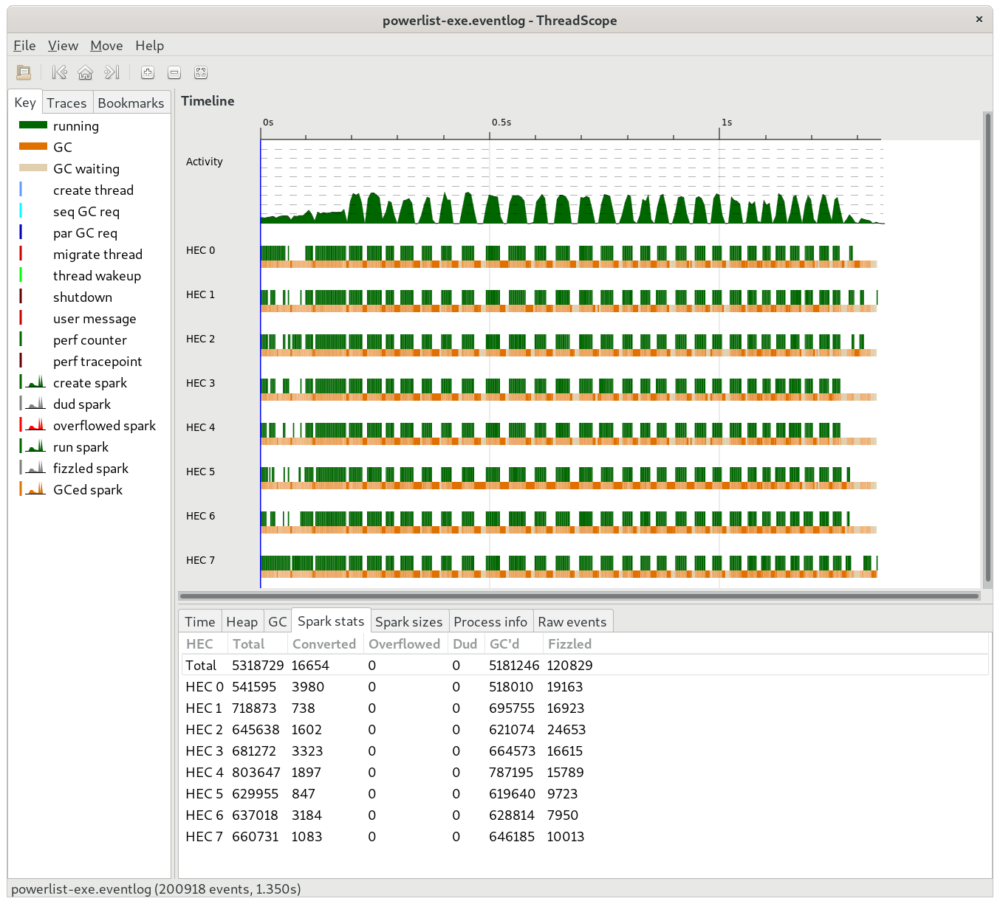

# Benchmarks
We list the benchmark of various supported algorithms here.
All benchmarks are performed on an 8 core (X2) Intel i9-9900K CPU @ 3.60GHz running Debian 11 (bullseye).
System has 32G of memory, and we specify wherever extra memory was supplied.

Benchmarks have been executed using [criterion](https://hackage.haskell.org/package/criterion) package, but threadscope analysis has also been used to analyze the performance of each algorithm.

The output from the algorithms is the sum of the prefix sum array. This is to make sure everything was computed as expected.

## Results Summary

### Scan SPS

|Algo|Description|Array Size|Chunk Size|Num Cores|Time taken (s)|Threadscope Log|
|----|-----------|----------|----------|---------|--------------|---------------|
|[SPSPL](#sps-sequential-scan-using-powerlist)|Sequential scan using powerlist|2^20|-|1|5.232|-|
|[SPSPLPar1](#spspl-parallel-scan-using-powerlist-v1)|Parallel scan using powerlist|2^20|-|8|1.506|[SPSPLPar120.eventlog](https://github.com/saucam/powerlist-threadscope/blob/main/SPSPar/SPSPLPar120.eventlog)|
|[SPSUBVecPLPar](#spsubvecplpar)||2^20|1024|8|0.520||


### Scan LDF

|Algo|Description|Array Size|Chunk Size|Num Cores|Time taken (s)|Threadscope Log|
|----|-----------|----------|----------|---------|--------------|---------------|
|LDFPar||2^20|100|8|0.644|[LDFPar20CS100.eventlog](https://github.com/saucam/powerlist-threadscope/blob/main/LDFPar/LDFPar20CS100.eventlog)|
|LDFUBVecPLPar||2^20|1024|8|0.165||
|LDFChunkUBVecPLPar|Hybrid approach between Bleloch and LDFUBVecPLPar|2^20|2^10|8|97.76||

### Sort

|Algo|Description|Array Size|Num Cores|Time taken (s)|Threadscope Log|
|----|-----------|----------|---------|--------------|---------------|
|BATCHER|The sequential batcher merge sort|2^20|1|3.929||
|BATCHER|Parallel batcher merge sort|2^20|8|1.721|

Check below for more details.

## Scan

### SPSPL (Sequential Scan using powerlist)

The sequential prefix sum using powerlist performs poorly as the array grows. It is expected since we introduce
recursion in an otherwise linear algorithm and generate a lot of intermediate lists which are GC'd.

Benchmarking results over a list of size 2^20:
```
$ stack exec powerlist-bench -- main/scan/seq/SPSPL +RTS
benchmarking main/scan/seq/SPSPL
time                 5.232 s    (5.208 s .. 5.241 s)
                     1.000 R²   (1.000 R² .. 1.000 R²)
mean                 5.334 s    (5.289 s .. 5.408 s)
std dev              70.09 ms   (20.22 ms .. 89.39 ms)
variance introduced by outliers: 19% (moderately inflated)

```

### SPSPLPar1 (Parallel Scan using powerlist v1)

This is first attempt at parallelizing prefix sum implementation using powerlists.

As we can see from below threadscope result, there are several issues:


- The initial unzip tuple computation delays the parallelization
- A lot of sparks are getting created, most of them get GCd
- There are GC delays

Still there is quite an improvement over ```SPSPL```,  !

```
$ stack exec powerlist-bench -- main/scan/par/nc/SPSPLPar1 +RTS -N8
benchmarking main/scan/par/nc/SPSPLPar1
time                 1.506 s    (1.316 s .. 1.576 s)
                     0.996 R²   (0.994 R² .. 1.000 R²)
mean                 1.393 s    (1.324 s .. 1.448 s)
std dev              77.82 ms   (70.55 ms .. 79.28 ms)
variance introduced by outliers: 19% (moderately inflated)
```

### SPSPLPar2 (Parallel Prefix sum using powerlist v2)

We benchmark at 3 different chunk size 128, 256, 512

```
$ stack exec powerlist-bench -- --match pattern SPSPLPar2 +RTS -N8
benchmarking main/scan/par/128/SPSPLPar2
time                 1.635 s    (1.429 s .. 1.691 s)
                     0.997 R²   (0.990 R² .. 1.000 R²)
mean                 1.559 s    (1.529 s .. 1.622 s)
std dev              49.62 ms   (29.51 ms .. 55.08 ms)
variance introduced by outliers: 19% (moderately inflated)

benchmarking main/scan/par/256/SPSPLPar2
time                 1.525 s    (1.486 s .. 1.625 s)
                     0.999 R²   (0.996 R² .. 1.000 R²)
mean                 1.549 s    (1.531 s .. 1.579 s)
std dev              30.26 ms   (15.70 ms .. 34.72 ms)
variance introduced by outliers: 19% (moderately inflated)

benchmarking main/scan/par/512/SPSPLPar2
time                 1.542 s    (NaN s .. 1.665 s)
                     0.999 R²   (0.996 R² .. 1.000 R²)
mean                 1.557 s    (1.541 s .. 1.567 s)
std dev              25.17 ms   (12.45 ms .. 28.79 ms)
variance introduced by outliers: 19% (moderately inflated)
```

Slightly worse than previous, most likely due to lot of sparks being created:



### SPSPLPar3 (Parallel Prefix sum using powerlist, introduce depth)

Reduce the number of sparks by recursing till a certain depth.

```
$ stack exec powerlist-bench -- --match pattern SPSPLPar3 +RTS -N8
benchmarking main/scan/par/128/SPSPLPar3
time                 1.399 s    (1.287 s .. 1.497 s)
                     0.999 R²   (0.997 R² .. 1.000 R²)
mean                 1.475 s    (1.447 s .. 1.503 s)
std dev              51.38 ms   (32.67 ms .. 65.55 ms)
variance introduced by outliers: 19% (moderately inflated)

benchmarking main/scan/par/256/SPSPLPar3
time                 1.397 s    (1.252 s .. 1.413 s)
                     0.998 R²   (0.994 R² .. 1.000 R²)
mean                 1.434 s    (1.410 s .. 1.453 s)
std dev              41.29 ms   (29.74 ms .. 47.58 ms)
variance introduced by outliers: 19% (moderately inflated)

benchmarking main/scan/par/512/SPSPLPar3
time                 1.391 s    (1.390 s .. 1.404 s)
                     1.000 R²   (1.000 R² .. 1.000 R²)
mean                 1.414 s    (1.403 s .. 1.423 s)
std dev              15.59 ms   (3.254 ms .. 20.39 ms)
variance introduced by outliers: 19% (moderately inflated)
```

Performs slightly better. We can see the number of sparks have reduced:


### LDF (Sequential scan using Ladner Fischer algorithm)

Performs much better since this algorithm does less work than SPS.

```
$ stack exec powerlist-bench -- main/scan/seq/LDF
benchmarking main/scan/seq/LDF
time                 490.7 ms   (426.7 ms .. 574.2 ms)
                     0.997 R²   (0.989 R² .. 1.000 R²)
mean                 443.6 ms   (429.5 ms .. 455.9 ms)
std dev              29.15 ms   (23.32 ms .. 32.58 ms)
variance introduced by outliers: 19% (moderately inflated)
```

### LDFPar (Parallel scan using Ladner Fischer algorithm)

Parallel version, further reduces the time, uses chunking for operations like ```zipWith```

```
benchmarking main/scan/par/128/LDFPar
time                 459.8 ms   (413.8 ms .. 614.0 ms)
                     0.977 R²   (0.917 R² .. 1.000 R²)
mean                 436.2 ms   (426.9 ms .. 460.8 ms)
std dev              40.72 ms   (148.6 μs .. 46.38 ms)
variance introduced by outliers: 22% (moderately inflated)

benchmarking main/scan/par/256/LDFPar
time                 467.6 ms   (355.2 ms .. 542.9 ms)
                     0.994 R²   (0.979 R² .. 1.000 R²)
mean                 419.5 ms   (358.7 ms .. 442.6 ms)
std dev              43.17 ms   (15.77 ms .. 52.87 ms)
variance introduced by outliers: 23% (moderately inflated)

benchmarking main/scan/par/512/LDFPar
time                 392.1 ms   (358.8 ms .. 450.1 ms)
                     0.998 R²   (0.994 R² .. 1.000 R²)
mean                 383.7 ms   (371.3 ms .. 395.3 ms)
std dev              19.57 ms   (1.240 ms .. 26.99 ms)
variance introduced by outliers: 19% (moderately inflated)
```

Sparks have reduced significantly as expected, and hence the better run time:


Load seems to be distributed evenly. There are GC pauses as expected as many intermediate lists are generated.

### SPSUBVecPLPar

This is variation of SPSPLPar3 using Unboxed Vector, with additional improvements
Significant improvement over ```SPSPLPar3``` is seen. We try several chunk sizes

```
$ stack exec powerlist-bench -- --match pattern SPSUBVecPLPar --output SPSUBVecPLPar.html +RTS -N8 
benchmarking main/scan/par/128/SPSUBVecPLPar
time                 523.9 ms   (486.6 ms .. 577.5 ms)
                     0.996 R²   (0.992 R² .. 1.000 R²)
mean                 532.4 ms   (524.0 ms .. 548.8 ms)
std dev              17.63 ms   (15.04 ms .. 18.74 ms)
variance introduced by outliers: 19% (moderately inflated)

benchmarking main/scan/par/256/SPSUBVecPLPar
time                 649.3 ms   (604.8 ms .. 699.1 ms)
                     0.999 R²   (0.997 R² .. 1.000 R²)
mean                 608.4 ms   (592.1 ms .. 629.2 ms)
std dev              25.95 ms   (10.89 ms .. 35.56 ms)
variance introduced by outliers: 19% (moderately inflated)

benchmarking main/scan/par/512/SPSUBVecPLPar
time                 565.4 ms   (551.3 ms .. 585.4 ms)
                     0.999 R²   (0.999 R² .. 1.000 R²)
mean                 602.2 ms   (588.6 ms .. 620.0 ms)
std dev              19.84 ms   (11.86 ms .. 24.04 ms)
variance introduced by outliers: 19% (moderately inflated)

benchmarking main/scan/par/1024/SPSUBVecPLPar
time                 520.3 ms   (482.5 ms .. 524.5 ms)
                     0.999 R²   (0.999 R² .. 1.000 R²)
mean                 536.4 ms   (531.7 ms .. 543.0 ms)
std dev              11.93 ms   (9.853 ms .. 13.74 ms)
variance introduced by outliers: 19% (moderately inflated)

benchmarking main/scan/par/2048/SPSUBVecPLPar
time                 579.4 ms   (542.7 ms .. 654.8 ms)
                     0.997 R²   (0.997 R² .. 1.000 R²)
mean                 554.5 ms   (521.0 ms .. 573.4 ms)
std dev              34.79 ms   (7.334 ms .. 42.17 ms)
variance introduced by outliers: 19% (moderately inflated)

benchmarking main/scan/par/4096/SPSUBVecPLPar
time                 615.7 ms   (577.8 ms .. 644.4 ms)
                     1.000 R²   (0.999 R² .. 1.000 R²)
mean                 575.5 ms   (545.6 ms .. 592.9 ms)
std dev              29.83 ms   (6.236 ms .. 38.26 ms)
variance introduced by outliers: 19% (moderately inflated)

benchmarking main/scan/par/8192/SPSUBVecPLPar
time                 546.8 ms   (514.5 ms .. 569.8 ms)
                     0.998 R²   (0.998 R² .. 1.000 R²)
mean                 544.6 ms   (526.8 ms .. 552.1 ms)
std dev              17.59 ms   (5.972 ms .. 19.91 ms)
variance introduced by outliers: 19% (moderately inflated)
```

Chunk size around 1024 performs best in general.

A lot of sparks are generated:


### LDFUBVecPLPar (LDFPar using Unboxed Vector)

Again trying several chunk sizes

```
$ stack exec powerlist-bench -- --match pattern LDFUBVecPLPar --output LDFUBVecPLPar.html +RTS -N8 
benchmarking main/scan/par/128/LDFUBVecPLPar
time                 198.1 ms   (183.2 ms .. 219.1 ms)
                     0.989 R²   (0.973 R² .. 1.000 R²)
mean                 183.2 ms   (172.2 ms .. 196.9 ms)
std dev              27.82 ms   (8.755 ms .. 37.65 ms)
variance introduced by outliers: 47% (moderately inflated)

benchmarking main/scan/par/256/LDFUBVecPLPar
time                 185.7 ms   (177.4 ms .. 207.9 ms)
                     0.994 R²   (0.989 R² .. 1.000 R²)
mean                 175.8 ms   (169.5 ms .. 179.6 ms)
std dev              9.922 ms   (8.190 ms .. 12.46 ms)
variance introduced by outliers: 14% (moderately inflated)

benchmarking main/scan/par/512/LDFUBVecPLPar
time                 190.8 ms   (154.8 ms .. 252.5 ms)
                     0.988 R²   (0.964 R² .. 1.000 R²)
mean                 188.3 ms   (179.7 ms .. 192.9 ms)
std dev              13.31 ms   (9.046 ms .. 16.23 ms)
variance introduced by outliers: 15% (moderately inflated)

benchmarking main/scan/par/1024/LDFUBVecPLPar
time                 165.4 ms   (133.5 ms .. 198.8 ms)
                     0.982 R²   (0.963 R² .. 1.000 R²)
mean                 186.3 ms   (174.8 ms .. 192.9 ms)
std dev              12.89 ms   (9.258 ms .. 14.17 ms)
variance introduced by outliers: 15% (moderately inflated)

benchmarking main/scan/par/2048/LDFUBVecPLPar
time                 183.1 ms   (172.4 ms .. 189.5 ms)
                     0.994 R²   (0.987 R² .. 1.000 R²)
mean                 160.9 ms   (146.6 ms .. 169.8 ms)
std dev              20.63 ms   (5.840 ms .. 28.87 ms)
variance introduced by outliers: 40% (moderately inflated)

benchmarking main/scan/par/4096/LDFUBVecPLPar
time                 190.9 ms   (183.9 ms .. 197.4 ms)
                     0.989 R²   (0.974 R² .. 1.000 R²)
mean                 160.4 ms   (148.3 ms .. 171.1 ms)
std dev              22.41 ms   (16.15 ms .. 29.62 ms)
variance introduced by outliers: 41% (moderately inflated)

benchmarking main/scan/par/8192/LDFUBVecPLPar
time                 185.0 ms   (168.1 ms .. 197.0 ms)
                     0.996 R²   (0.988 R² .. 1.000 R²)
mean                 161.5 ms   (145.1 ms .. 172.3 ms)
std dev              21.28 ms   (4.371 ms .. 29.02 ms)
variance introduced by outliers: 32% (moderately inflated)
```

Chunk size 1024 stands out.

Threadscope looks quite clean as well


### LDFChunkUBVecPLPar (Hybrid LDFPar and Bleloch algorithm)

The chunk size here actually is the splitting of input vector itself and not splitting the operators like ```zipWith```.

We try several chunk sizes from 4 till 10

```
$ stack exec powerlist-bench -- --match pattern LDFChunkUBVecPLPar --output LDFChunkUBVecPLPar.html +RTS -N8 
benchmarking main/scan/par/4/LDFChunkUBVecPLPar
time                 422.3 ms   (413.3 ms .. 439.6 ms)
                     1.000 R²   (1.000 R² .. 1.000 R²)
mean                 399.7 ms   (389.1 ms .. 408.1 ms)
std dev              18.44 ms   (422.5 μs .. 22.25 ms)
variance introduced by outliers: 19% (moderately inflated)

benchmarking main/scan/par/5/LDFChunkUBVecPLPar
time                 394.3 ms   (352.7 ms .. 507.8 ms)
                     0.981 R²   (0.934 R² .. 1.000 R²)
mean                 361.3 ms   (336.0 ms .. 401.3 ms)
std dev              44.59 ms   (32.90 ms .. 58.48 ms)
variance introduced by outliers: 23% (moderately inflated)

benchmarking main/scan/par/6/LDFChunkUBVecPLPar
time                 356.9 ms   (344.4 ms .. 396.7 ms)
                     0.995 R²   (0.986 R² .. 1.000 R²)
mean                 303.9 ms   (267.6 ms .. 332.3 ms)
std dev              43.36 ms   (13.99 ms .. 57.52 ms)
variance introduced by outliers: 38% (moderately inflated)

benchmarking main/scan/par/7/LDFChunkUBVecPLPar
time                 229.3 ms   (-133.8 ms .. 487.6 ms)
                     0.639 R²   (0.070 R² .. 1.000 R²)
mean                 258.3 ms   (180.4 ms .. 311.2 ms)
std dev              93.41 ms   (43.44 ms .. 121.7 ms)
variance introduced by outliers: 78% (severely inflated)

benchmarking main/scan/par/8/LDFChunkUBVecPLPar
time                 99.13 ms   (95.93 ms .. 104.0 ms)
                     0.995 R²   (0.992 R² .. 0.998 R²)
mean                 94.21 ms   (90.92 ms .. 98.43 ms)
std dev              7.318 ms   (6.771 ms .. 8.525 ms)
variance introduced by outliers: 21% (moderately inflated)

benchmarking main/scan/par/9/LDFChunkUBVecPLPar
time                 102.7 ms   (97.31 ms .. 118.5 ms)
                     0.987 R²   (0.952 R² .. 1.000 R²)
mean                 99.10 ms   (89.38 ms .. 104.5 ms)
std dev              11.83 ms   (3.499 ms .. 13.54 ms)
variance introduced by outliers: 32% (moderately inflated)

benchmarking main/scan/par/10/LDFChunkUBVecPLPar
time                 97.76 ms   (89.28 ms .. 105.1 ms)
                     0.989 R²   (0.956 R² .. 0.994 R²)
mean                 97.60 ms   (90.95 ms .. 103.2 ms)
std dev              10.91 ms   (7.616 ms .. 16.09 ms)
variance introduced by outliers: 32% (moderately inflated)
```

The chunked approach with chunk size 10 works excellent!

The merging at the end is sequential otherwise it could have been even better.


## Sort

### BATCHER

We list the results of batcher sort, first by running on single core, then on 8 cores

1 core
```
$ stack exec powerlist-bench -- main/sort/BATCHER
benchmarking main/sort/BATCHER
time                 3.929 s    (3.661 s .. 4.113 s)
                     0.999 R²   (0.998 R² .. 1.000 R²)
mean                 3.863 s    (3.793 s .. 3.910 s)
std dev              71.95 ms   (35.52 ms .. 101.1 ms)
variance introduced by outliers: 19% (moderately inflated)
```

8 cores
```
$ stack exec powerlist-bench -- main/sort/BATCHER --output BATCHER.html +RTS -N8
benchmarking main/sort/BATCHER
time                 1.721 s    (1.654 s .. NaN s)
                     1.000 R²   (NaN R² .. 1.000 R²)
mean                 1.695 s    (1.679 s .. 1.706 s)
std dev              15.66 ms   (6.156 ms .. 21.71 ms)
variance introduced by outliers: 19% (moderately inflated)
```